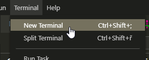
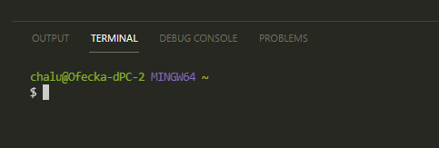
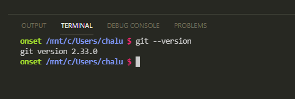
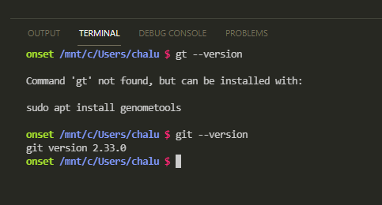

# Práce s gitem

Git je nástroj na správu kódu. Užitečný zejména pro zálohu kódu, sdílení s dalšími účastníky, napojení na další služby jako je například webový hosting.

## Git vs GitHub

- Git si instaluješ k sobě na počítač.
- [GitHub](https://github.com/), [GitLab](https://about.gitlab.com/), [Bitbucket](https://bitbucket.org/) jsou služby, které si dobře rozumí s gitem. Umí si od něj nechat nahrát kód a tím ho zazálohovat v internetu.

## Ověření instalace

- Ve Visual Studio Code otevři nový terminál / příkazovou řádku přes horní lištu `Terminal` > `New Terminal`.

  

- U spodní hrany ti vyjede záložka Terminal. Může vypadat například takto:

  

  

  

  

- Klikni do ní myší a napiš `git --version`. Stiskni klávesu `Enter`. Pokud uděláš překlep, použij šipky a klávesu `Backspace` nebo `Delete`. Na klikání myší do určité části textu se moc nespoléhej. Terminál je z doby, kdy myši ještě nebyly vynalezené. Ovládá se tak jen z klávesnice.

- Pokud máš git nainstalovaný, na následujícím řádku by se ti mělo vypsat něco jako `git version 2.33.0` nebo třeba `git version 2.20.1.windows.1`. Výpis se liší například podle tvého systému (Windows, Mac, Linux) a verze.

  

- Pokud ve výpisu vidíš `Command 'git' not found, did you mean …`, `'git' is not recognized as an internal or external command, operable program or batch file.` nebo podobnou hlášku, je možné, že máš v příkaze `git ‑‑version` překlep nebo nemáš git nainstalovaný. Zkus příkaz znovu napsat a spustit klávesou `Enter`. Nic víc nepiš. Znak `$` nebo `>` bývá v příkazové řádce předchystaný a my ho tedy při zadávání příkazů neopisujeme.

  

## První krůčky s gitem

- Pomocí gitu budeš na projektech zaznamenávat jednotlivé kroky, úpravy kódu, html, css, ale i obrázků. Vznikne tím historie, díky které si později budeš moct připomenout, proč jsi co v kódu měnila a případně se budeš moct ke starší verzi i vrátit, když třeba zjistíš, že původní varianta byla lepší nebo se ti aktuální rozbila a nedaří se ti ji opravit.

- Každý krok, balíček změn, které typicky řeší jednu menší komponentu, stylování tlačítka, přidání navigace na spránce apod. se v názvosloví gitu jmenuje `commit`. Každý commit má svého autora, a proto musíš gitu říct, jak se jmenuješ a jaká je tvá e-mailová adresa. Pro oba údaje je ideální vyplnit stejné údaje jako na [GitHubu](https://github.com/).

- Jméno nastav příkazem `git config --global user.name "Jméno Příjmení"` a stiskni `Enter`.

- E-mail nastav příkazem `git config --global user.email "muj@email.cz"` a stiskni `Enter`.

  

- Většinou se také hodí gitu říct, že jako hlavní nástroj pro psaní kódu používáš Visual Studio Code. To uděláš příkazem `git config --global core.editor "code --wait"`.

- Toto nastavení je pro všechny projekty společné a stačí ho po čerstvé instalaci gitu provést pouze jednou.

- Pokud si chceš zkontrolovat, že máš hodnoty správně nastavené, pusť příkazy bez hodnoty v uvozovkách.

  

## GitHub pages

Kromě podpory gitu GitHub nabízí doplňkovou službu GitHub pages, díky které je možné si nechat zdarma hostovat stránky.
