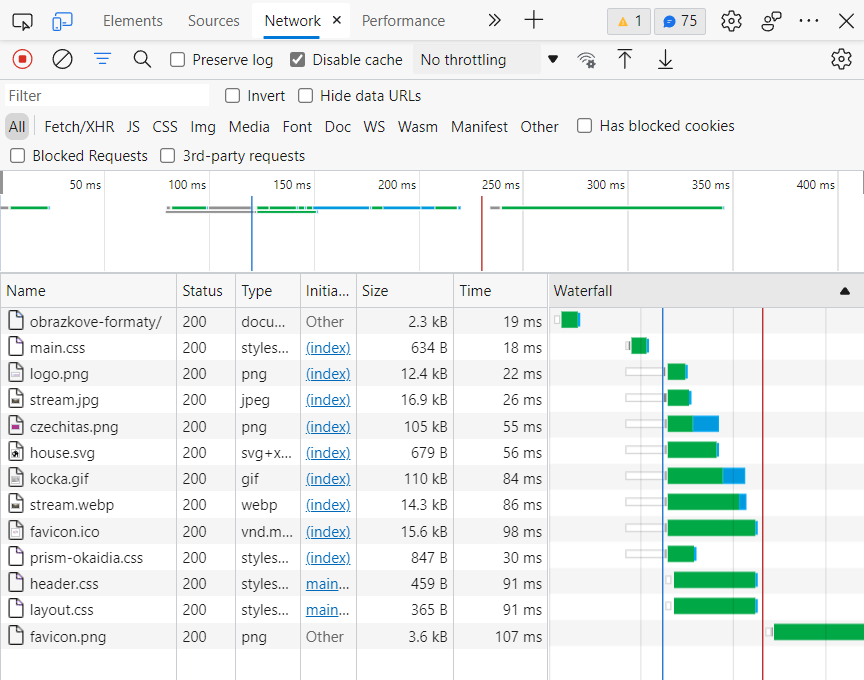

# Síť

Pro rychlé načítání webu je užitečné hlídat, co se přenáší přes síť, přes internet k uživateli. Každý přenesený kilobajt zabere nějaký čas. Dále záleží na pořádí. Typicky cílíme na to, aby se jako první načetl obsah, styly, obrázky toho, co uživatel uvidí jako první.

S pokročilou analýzou přenosů přes síť nám pomohou vývojářské nástroje a jejich panel `Network` (Síť).



Po levé straně vidíme názvy souborů, které prohlížeč stáhl. Začíná s HTML `obrazkove-formaty/`, ze kterého se dozvěděl, jaké další soubory potřebuje. Jak postupně objevoval další, můžeme vyčíst z posledního sloupce `Waterfall` (vodopád). Další zajímavý údaj najdeme ve sloupci `Size` (velikost), podle kterého můžeme často odhadnout, které soubory jsou až moc velké a zasloužily by si zmenšit.

V ukázkovém příkladu by stálo za kontrolu, jestli třeba obrázky `czechitas.png` a `kocka.gif` nemůžeme zmenšit. Nehodí se to vždy, ale u velikostí v řádu stovek KB nebo dokonce MB bychom měli minimálně zpozornět.

U obrázků můžeme také zvážit líné načítání až ve chvíli, kdy se najíždí do obrazovky pomocí atributu `loading="lazy"`. To se může nejvíce vyplatit třeba u obrázků v patičce nebo na hodně dlouhých stránkách.

```html

```

Dále si můžeme všimnout, že některé CSS soubory se načítají skoro až poslední. Prohlížeč stylům přiřazuje vysokou důležitost a bez nich uživateli jen tak něco neukáže. Proto by bylo dobré zapřemýšlet, jak je načíst dříve. Ideálně ještě před obrázky. Dost často stačí jen všechny styly spojit do jednoho souboru třeba pomocí SASSu.

## Úkol na teď

Postupuj podle zadání na [github.com/…/Cviceni-Rychlost-nacitani](https://github.com/Czechitas-podklady-WEB/Cviceni-Rychlost-nacitani).
